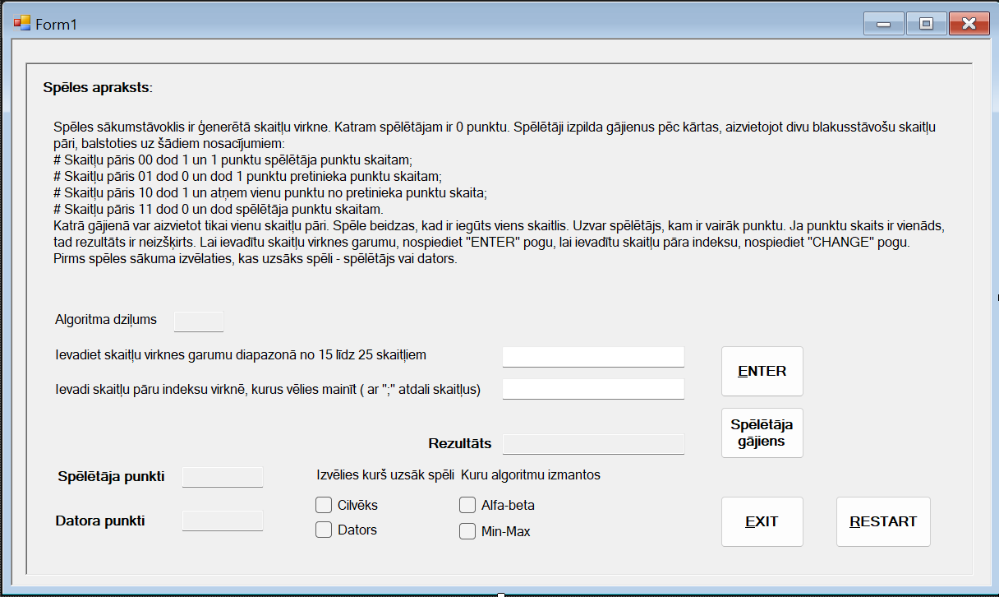

#  AI Game (C# – Minimax & Alpha-Beta)

Universitātes projekts, kas demonstrē mākslīgā intelekta pielietojumu spēlēs, izmantojot **Minimax** un **Alpha-Beta pruning** algoritmus.  
Spēle veidota kā **Windows Forms** aplikācija ar interaktīvu lietotāja saskarni.

##  Mērķis
Izstrādāt spēli, kas:
- ļauj izvēlēties, kurš spēlētājs sāk (cilvēks vai dators),
- ļauj izvēlēties, kuru algoritmu izmantos dators (Minimax vai Alpha-Beta),
- demonstrē meklēšanas koka ģenerēšanu un heuristisko novērtējumu,
- nodrošina spēles vizualizāciju un atkārtotu palaišanu.

##  Izmantotās tehnoloģijas
- **C# (.NET Framework)**  
- **Windows Forms GUI**  
- **Minimax un Alpha-Beta algoritmi**  
- **Visual Studio**  

##  Darbība
Spēle nodrošina izvēlnes un GUI elementus, ļaujot spēlētājam redzēt katru gājienu un algoritma izvēles rezultātus.  
Pēc katras spēles iespējams sākt jaunu raundu.
